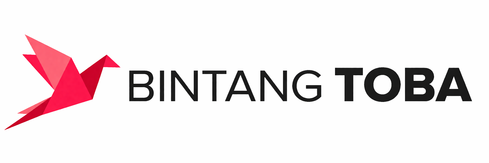

# Delta Polder Indonesia

**Software Engineering · Digital Product Development · Open Source**

  A professional engineering profile maintained by Bintang Toba. 
  Focused on building reliable, maintainable, and accessible software products.

  <a href="https://github.com/Delta-Polder-Indonesia?tab=repositories">Repositories</a>
  ·
  <a href="https://github.com/Delta-Polder-Indonesia">GitHub Profile</a>
  ·
  <a href="https://github.com/Delta-Polder-Indonesia/Delta-Polder-Indonesia/issues">Contact</a>

---

## Overview

Delta Polder Indonesia is an independent software engineering profile focused on modern web development, backend systems, data management, and open-source collaboration. The objective is to deliver practical digital products through clear architecture, maintainable code, and disciplined engineering practices.

This profile is maintained by **Bintang Toba**, a full-stack developer with an interest in TypeScript, Next.js, Node.js, databases, cloud technologies, and developer tooling.

## Core Capabilities

| Capability | Scope |
| --- | --- |
| Web Application Development | Responsive, accessible, and maintainable user-facing applications |
| Backend Engineering | APIs, application services, authentication, and business logic |
| Data Management | Relational and document databases, schema design, and data access layers |
| Product Engineering | Technical planning, implementation, testing, and iterative improvement |
| Developer Experience | Reproducible environments, version control, documentation, and automation |

## Technology Areas

<table>
  <tr>
    <td><strong>Languages</strong></td>
    <td>TypeScript, JavaScript, SQL</td>
  </tr>
  <tr>
    <td><strong>Frontend</strong></td>
    <td>React, Next.js, Tailwind CSS</td>
  </tr>
  <tr>
    <td><strong>Backend</strong></td>
    <td>Node.js, Express, REST APIs</td>
  </tr>
  <tr>
    <td><strong>Data</strong></td>
    <td>PostgreSQL, MongoDB, Prisma</td>
  </tr>
  <tr>
    <td><strong>Engineering Tools</strong></td>
    <td>Docker, Git, Visual Studio Code, Figma</td>
  </tr>
</table>

## Engineering Principles

The work published through this profile is guided by the following principles:

1. **Clarity** — solutions should be understandable, documented, and appropriate for their context.
2. **Maintainability** — architecture and code should support safe, incremental change.
3. **Reliability** — expected behavior should be verified through review, validation, and testing.
4. **Security** — permissions, dependencies, and data should be handled responsibly.
5. **Accessibility** — digital products should be usable by as many people as reasonably possible.
6. **Continuous improvement** — tools and practices should evolve based on evidence and experience.

## Current Direction

Current areas of learning and development include:

- scalable full-stack application architecture;
- cloud deployment and operational practices;
- application performance and web accessibility;
- database design and reliable data access;
- open-source collaboration and technical documentation.

## Projects and Collaboration

Public work is available in the [repository directory](https://github.com/Delta-Polder-Indonesia?tab=repositories). Each project should be evaluated using its own documentation, license, release status, and maintenance information.

Constructive technical discussion, issue reports, and collaboration proposals are welcome. For repository-specific matters, open an issue in the relevant project. For general enquiries about this profile, use the [profile repository issue tracker](https://github.com/Delta-Polder-Indonesia/Delta-Polder-Indonesia/issues).

## Maintenance

This profile and its public repositories are maintained independently. Project maturity, support level, and contribution requirements may vary between repositories. Refer to each repository for its current status and usage instructions.

---

<strong>Delta Polder Indonesia</strong> 
Software Engineering and Digital Product Development

  

Maintained by Bintang Toba · Copyright 2024–2026

